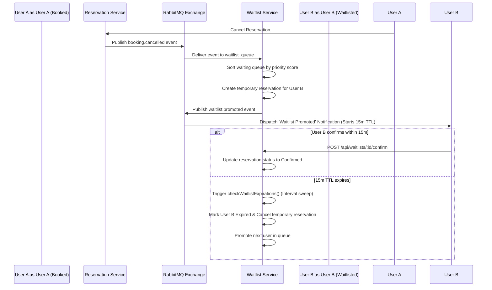

# TinkerTrack — System Architecture & Feature Documentation

Welcome to the comprehensive technical documentation for **TinkerTrack**, a high-performance, concurrent, and intelligent resource booking and waitlist management platform. 

This document details the system design, core logic modules, API schema specifications, concurrency protection, and usage guidelines for developers.

---

## 1. System Overview & Architecture

TinkerTrack uses a distributed, event-driven microservices architecture designed to support low-latency scheduling, robust concurrent resource locking, and smart scheduling recommendations.

```
                  +-----------------------------------+
                  |        Client Applications        |
                  |     (Web App, Mobile, Admin)      |
                  +-----------------+-----------------+
                                    |
                                    v
                  +-----------------+-----------------+
                  |           API Gateway             |
                  |     (Port 5005 - Proxy/Auth)      |
                  +--------+-------+--------+---------+
                           |       |        |
         +-----------------+       |        +-----------------+
         |                         v                          |
+--------v--------+       +--------v--------+       +---------v-------+
|  User & Auth    |       |  Resource       |       |  Reservation    |
|  (Port 5010)    |       |  Catalog (5020) |       |  (Port 5030)    |
+--------+--------+       +--------+--------+       +---------+-------+
         |                         |                          |
         |                         |                          |
+--------v-------------------------v--------------------------v-------+
|                        Distributed Cache (Redis)                    |
+----------------------------------+----------------------------------+
                                   |
                                   v
+----------------------------------+----------------------------------+
|                   Database Layer (PostgreSQL)                       |
+----------------------------------+----------------------------------+
                                   |
                                   v
+----------------------------------+----------------------------------+
|                   Message Broker (RabbitMQ Exchange)                |
+---+------------------------------+------------------------------+---+
    |                              |                              |
    v                              v                              v
+---+-------------+        +-------+---------+        +-----------+---+
|  Waitlist       |        |  Notification   |        |  Analytics    |
|  (Port 5040)    |        |  (Port 5050)    |        |  (Port 5060)  |
+-----------------+        +-----------------+        +---------------+
```

### Core Architecture Layers
1. **API Gateway (Port 5005)**: Built using Express and `express-http-proxy`. Authenticates incoming JWT tokens, decorates request headers with user details (ID, role, email, name), and routes traffic.
2. **PostgreSQL Database (Port 5433)**: Primary relational storage storing users, roles, categories, resources, reservations, waitlists, notifications, activity logs, and settings.
3. **Redis Cache (Port 6379)**: Acts as the distributed lock registry for resources to handle scheduling concurrency and waitlist promotions.
4. **RabbitMQ Broker (Port 5672)**: Operates a topic exchange (`tinkertrack_events`) to decouple side-effects such as activity logging, waitlist promotions, and notification delivery.

---

## 2. Dynamic Waitlist System & Queue Logic

When a user requests a resource that is booked during their desired slot, they are prompted to join a waitlist.

### 2.1 Priority Score Weight System
Waitlist queue positions are computed dynamically based on the user's role and historical booking usage to promote fair-use policies.

$$\text{Priority Score} = \text{Base Role Weight} - (\text{Total Bookings} \times \text{Active booking Penalty})$$

#### System Defaults
- **Undergraduate Base Weight**: `10`
- **Graduate Base Weight**: `20`
- **Staff Base Weight**: `30`
- **Admin Base Weight**: `40`
- **Active Booking Penalty**: `1` (subtracts priority score per reservation count)

*Example:* An undergraduate with 2 active bookings has a priority score of `10 - (2 * 1) = 8`. A graduate with 1 active booking has a priority score of `20 - (1 * 1) = 19`. The graduate will be positioned first in the queue.

### 2.2 Auto-Promotion Workflow
When an active booking is cancelled, or an unavailable resource is returned to "Available" status by an admin:
1. The backend triggers a RabbitMQ event (`booking.cancelled` or `resource.recovered`).
2. The `Waitlist Service` consumes the event, retrieves waiting users for overlapping periods from PostgreSQL, and sorts them by `Priority Score DESC`, then `Created Timestamp ASC` (FIFO tiebreaker).
3. The top waitlist entry is updated to `Promoted`.
4. A temporary, auto-expiring reservation (`status: PendingApproval`, representing pending confirmation) is created for the promoted user.
5. The user receives a persistent notification: *"Your waitlist slot has opened up. Claim it within 15 minutes!"*



---

## 3. Persistent Notification Subsystem

TinkerTrack features a database-backed, persistent notification system that alerts users of critical scheduling milestones.

### 3.1 Alert Triggers
Notifications are dynamically dispatched on the following triggers:
- **Admin Decisions**: When an administrator approves or rejects a pending booking request.
- **Waitlist Promotion**: When a slot opens up and a waitlisted user is promoted.
- **Resource Recovery**: When a resource transitions from "Maintenance" back to "Available".
- **Proactive Reminders**: When an upcoming reservation is scheduled to start within 2 hours.

---

## 4. Advanced Access Control Rules & Settings Console

Administrators can override access control rules and system configurations dynamically from the Admin Panel.

- **Booking Quotas**: Define max active bookings per role (e.g. undergraduate, graduate).
- **Waitlist Expiration TTL**: Adjust the promotion confirmation timeout claim window.
- **Priority Weights**: Tune role weights and booking penalties to shape queue sorting behaviors.
- **Role Restrictions**: Restrict specific resources to certain roles (e.g. Graduates Only) inside resource metadata.

---

## 5. Intelligent Scheduling & AI Assistant

To assist users in finding slots efficiently, TinkerTrack provides intelligent recommendations and natural language processing.

### 5.1 Smart Conflict Alternatives
If a user tries to reserve a timeslot that overlaps with an existing booking, the modal suggests:
- **Alternative Resources**: Other resources of the *same* category that are completely available during the requested period.
- **Alternative Slots**: The next 3 closest available standard slots for the *same* resource on that day or the next.

### 5.2 NLP Booking Assistant
The "AI Assistant" sidebar panel processes natural language queries using a fast, rule-based clientside NLP engine:
- **Query parsing**: Extracts targets ("Canon DSLR", "Study Room B"), dates ("today", "tomorrow", "Friday"), timeslots ("at 2 PM", "at 16:30"), and durations ("for 3 hours").
- **Smart actions**: Verifies availability and renders inline one-click buttons to book the resource, join the waitlist, or select suggested alternatives.

---

## 6. Database API Endpoint Reference

### 6.1 Authentication Endpoints (Port 5010)
- `POST /api/auth/register`: Register a new account.
- `POST /api/auth/login`: Authenticate credentials. Returns signed JWT.
- `GET /api/auth/me`: Decode current user credentials.

### 6.2 Reservation Endpoints (Port 5030)
- `GET /api/reservations`: Get reservations.
- `POST /api/reservations`: Request booking. Triggers lock validation and quota checks.
- `PUT /api/reservations/:id/checkin`: Mark booking as checked in.
- `PUT /api/reservations/:id/complete`: Complete a check-in.
- `PUT /api/reservations/:id/cancel`: Cancel reservation. Triggers waitlist promotion event.

### 6.3 Waitlist Endpoints (Port 5040)
- `GET /api/waitlists`: Retrieve waitlist records.
- `POST /api/waitlists`: Join waitlist queue for a resource and slot.
- `POST /api/waitlists/:id/confirm`: Confirm promotion claim.
- `POST /api/waitlists/:id/reject`: Decline promotion claim.

### 6.4 Notification Endpoints (Port 5050)
- `GET /api/notifications`: Retrieve user notification history.
- `POST /api/notifications/:id/read`: Mark notification as read.
- `POST /api/notifications/read-all`: Mark all notifications as read.

### 6.5 Admin Settings Endpoints (Port 5030)
- `GET /api/admin/settings`: Retrieve access weight settings.
- `PUT /api/admin/settings`: Update settings.

---

## 7. Concurrency Control

To guarantee strict schedule consistency and prevent double-bookings, the platform uses two layers of protection:

1. **Redis Locks (Layer 1)**: Before writing to database records, the Reservation service attempts to acquire a Redis lock for that resource (`lock:resource:{resource_id}`). If the lock is already held, the API immediately returns a `409 Conflict`.
2. **Database Exclusion Constraints (Layer 2)**: The PostgreSQL database implements an exclusion constraint using a GIST index:
   ```sql
   ALTER TABLE reservations ADD CONSTRAINT no_overlapping_bookings
   EXCLUDE USING gist (
       resource_id WITH =,
       tsrange(start_time, end_time, '[)') WITH &&
   ) WHERE (status IN ('Confirmed', 'PendingApproval', 'CheckedIn'));
   ```
   This ensures that no two overlapping half-open (`[)`) timeslots can be committed for the same resource, rejecting conflicting concurrent writes at the database transaction boundary.
